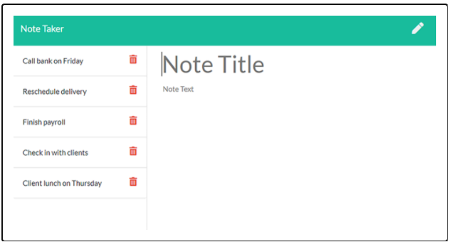
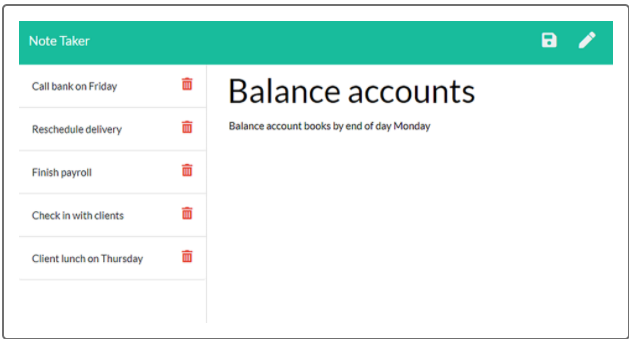

# Note Taker

## Description
An application that can be used to write, save, and delete notes. This application uses an Express.js backend and saves and retrieves note data from a JSON file that is deployed on Heroku.

## User Story
AS A small business owner
I WANT to be able to write and save notes
SO THAT I can organize my thoughts and keep track of tasks I need to complete.

## Acceptance Criteria
- GIVEN a note-taking application
- WHEN I open the Note Taker
- THEN I am presented with a landing page with a link to a notes page
- WHEN I click on the link to the notes page
- THEN I am presented with a page with existing notes listed in the left-hand column, plus empty fields to enter a new note title and the note’s text in the right-hand column
- WHEN I enter a new note title and the note’s text
- THEN a Save icon appears in the navigation at the top of the page
- WHEN I click on the Save icon
- THEN the new note I have entered is saved and appears in the left-hand column with the other existing notes
- WHEN I click on an existing note in the list in the left-hand column
- THEN that note appears in the right-hand column
- WHEN I click on the Write icon in the navigation at the top of the page
- THEN I am presented with empty fields to enter a new note title and the note’s text in the right-hand column

## Mock-Up

## Github Repository
All files and changes made are located on github at the following location:

https://github.com/htang2021/notetaker

## Application Live URL
https://htang-notetaker.herokuapp.com/

## Deploy Your Project
This instruction below assumes that a project and repo were already created on github and that they are already linked as appropriate.
(https://github.com/htang2021/notetaker).

1. From the local CLI at the root of the project repo, do a git clone or git pull
2. Install the appropriate NPM packages dependencies, $ npm install
3. Verify, or create if needed, that .gitignore include node_modules/, .DS_Store, and package-lock.json entries at the minimum
4. Perform git add, commit, and push as appropriate to baseline the deployment repository
5. Create a Heroku account, if not already, and verify that the heroku repository is visible by issuing $ git remote -v (or reference the heroku website for more details):
----------------
    $ git remote -v
    heroku  https://git.heroku.com/htang-notetaker.git (fetch)
    heroku  https://git.heroku.com/htang-notetaker.git (push)
    origin  git@github.com:htang2021/notetaker.git (fetch)
    origin  git@github.com:htang2021/notetaker.git (push)
6. Create a deployment instance from CLI, $ heroku create <unique-app-name>, and check to make sure it's created:
    -----------------
    $ heroku apps
    === hungtang@hotmail.com Apps
    htang-notetaker
7. 
4. Wait for a minute or two, GitHub will return a live site URL:
https://htang-notetaker.herokuapp.com/

End of README.md - updated by Hung Tang on 4/17/21